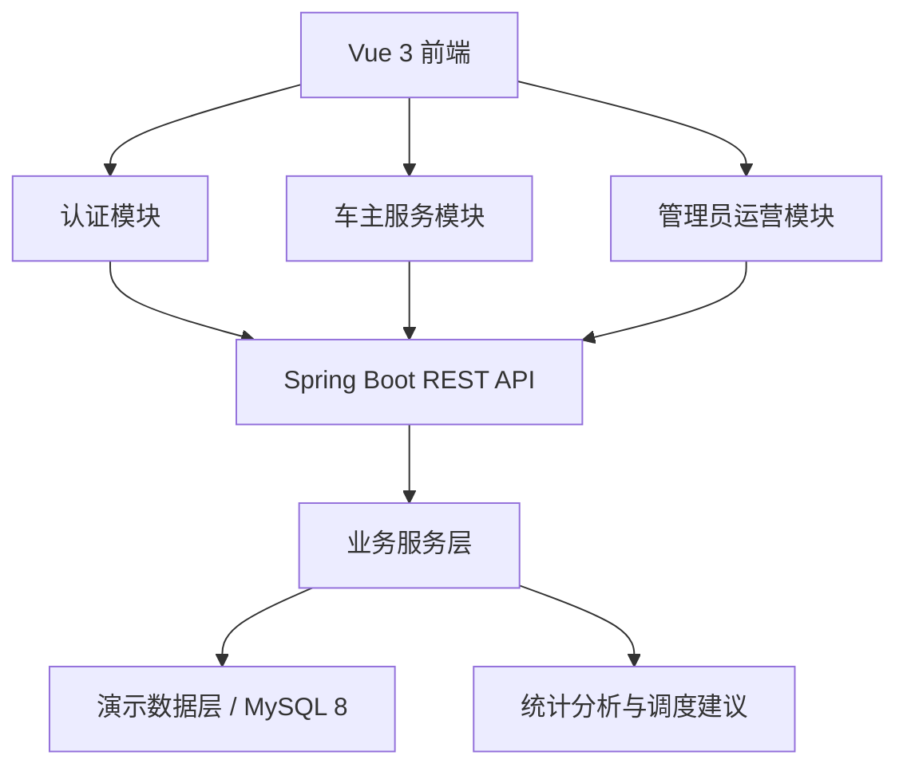
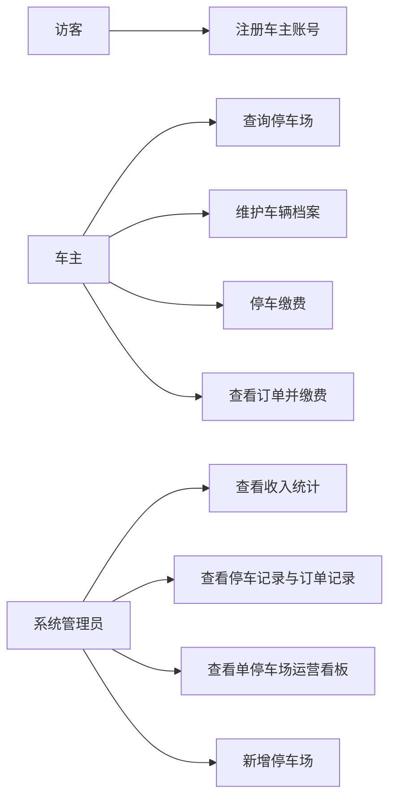
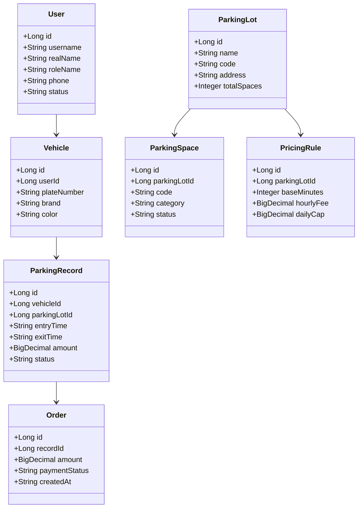
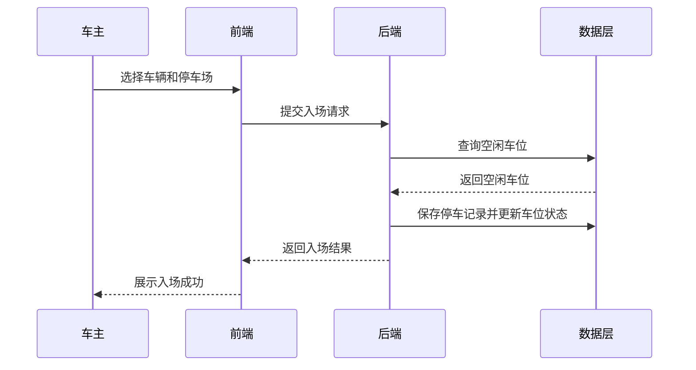
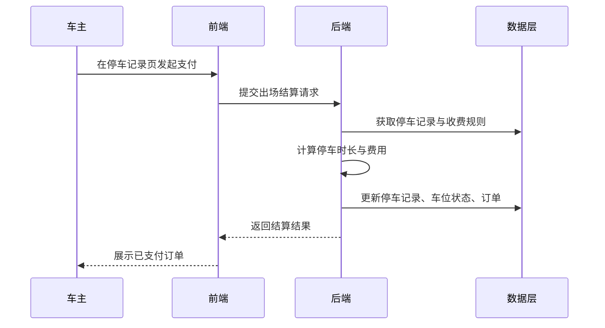
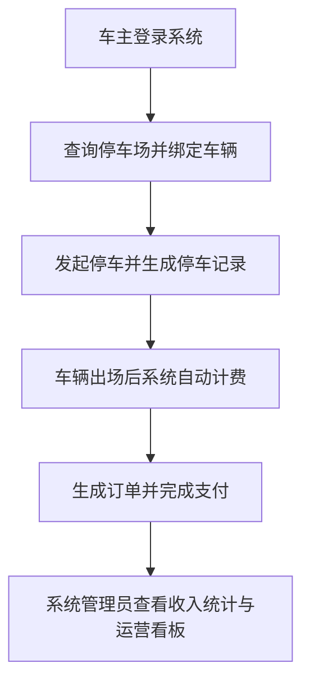
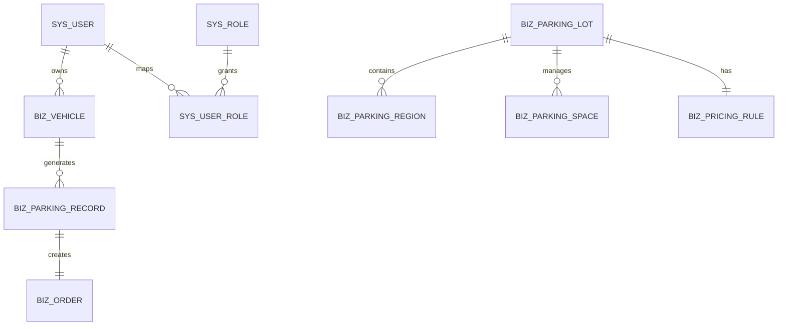

# 城市停车资源管理系统技术文档

## 1. 需求分析

### 1.1 项目背景

城市停车资源分散、车位状态变化快、传统人工登记效率低，导致停车难、管理难、运营分析难。本系统面向车主和系统管理员两类用户，构建一个统一的城市停车资源管理平台。

### 1.2 功能需求

- 用户与权限管理：支持车主注册、车主登录和系统管理员后台入口。
- 停车服务：支持停车场查询、车辆绑定、车辆删除、车辆入场、费用结算和订单查询。
- 记录管理：支持停车记录、订单记录和异常状态查看。
- 数据看板：展示停车场数量、车位总量、占用率、流量趋势、累计收入和单停车场运营数据。
- 资源调度建议：根据占用率生成预警等级和调度建议。
- 系统支撑：公告信息、操作日志、团队分工和演示说明。

### 1.3 非功能需求

- 界面直观，适合毕业设计答辩现场展示。
- 核心流程可在本地环境完整演示。
- 文档齐全，便于提交毕设材料。

### 1.4 角色需求

- 车主：完成账号注册、账号登录、停车场查询、车辆管理、停车缴费和订单查看。
- 系统管理员：完成收入统计、停车记录与订单记录查看、单停车场看板分析和停车场新增。

## 2. 系统设计

### 2.1 总体架构

架构说明：

- 表现层：使用 Vue 3 + TypeScript 构建车主端和管理员端页面。
- 接口层：使用 Spring Boot 提供统一 REST 接口。
- 业务层：封装认证、车辆、停车、订单、统计等核心业务逻辑。
- 数据层：当前版本以内置演示数据为主，同时保留 MySQL 建表脚本用于部署说明和论文展示。

### 2.1.1 单元模块设计

本系统在单元模块设计上采用分层思想进行组织，主要划分为表现层、控制层、业务层、数据访问层和实体层。

1. 表现层  
负责车主端和系统管理员端页面展示、表单输入、图表渲染、数据查询和结果反馈。

2. 控制层  
负责接收前端请求、完成参数校验、调用业务层并返回统一响应结果。  
主要控制类包括：
- `AuthController`
- `UserController`
- `ParkingController`
- `RecordController`
- `DashboardController`
- `SystemController`

3. 业务层  
负责处理系统核心业务逻辑，包括车主注册登录、车辆管理、停车入场、停车缴费、订单生成、收入统计和停车场运营分析。  
当前项目中的主要业务类为：
- `ParkingDemoService`

4. 数据访问层  
负责对用户、车辆、停车场、车位、停车记录、订单、公告和日志等数据进行查询与维护。  
当前演示版本采用内存集合模拟数据访问层，以保证答辩环境下系统稳定运行；若接入 MySQL，可进一步拆分为 `Mapper/Repository + Service` 结构。

5. 实体层  
负责抽象系统中的核心业务对象，为业务处理与数据库设计提供统一模型。

### 2.2 用例图

### 2.3 类图

类图说明：

- `User` 表示系统用户实体，包含车主和管理员两类对象，主要保存账号、姓名、角色、联系方式和状态信息。
- `Vehicle` 表示车辆实体，用于记录车主名下车辆的车牌号、品牌、颜色和状态。
- `ParkingLot` 表示停车场实体，用于管理停车场名称、编码、地址、营业时间及车位总量信息。
- `ParkingSpace` 表示车位实体，用于描述停车场内具体车位的编号、类型和当前状态。
- `PricingRule` 表示收费规则实体，用于定义免费时长、计费单价和封顶金额。
- `ParkingRecord` 表示停车记录实体，用于记录车辆入场、出场、停放时长和应付金额。
- `Order` 表示订单实体，用于记录停车缴费后的支付状态、支付时间和订单金额。

实体关系说明：

- 一个用户可绑定多辆车辆，因此 `User` 与 `Vehicle` 是一对多关系。
- 一个停车场可包含多个车位，因此 `ParkingLot` 与 `ParkingSpace` 是一对多关系。
- 一个停车场对应一套收费规则，因此 `ParkingLot` 与 `PricingRule` 是一对一关系。
- 一辆车可产生多条停车记录，因此 `Vehicle` 与 `ParkingRecord` 是一对多关系。
- 一条停车记录完成缴费后生成一条订单，因此 `ParkingRecord` 与 `Order` 是一对一关系。

### 2.4 时序图

#### 车辆入场

#### 车辆出场计费

### 2.5 业务流程图

### 2.6 E-R 图

## 3. 数据库表设计

| 表名 | 说明 | 关键字段 |
| --- | --- | --- |
| `sys_user` | 用户表 | `username`、`real_name`、`role_name` |
| `sys_role` | 角色表 | `role_code`、`role_name` |
| `sys_user_role` | 用户角色关联表 | `user_id`、`role_id` |
| `biz_vehicle` | 车辆表 | `user_id`、`plate_number` |
| `biz_parking_lot` | 停车场表 | `name`、`code`、`total_spaces` |
| `biz_parking_region` | 区域表 | `parking_lot_id`、`region_name` |
| `biz_parking_space` | 车位表 | `parking_lot_id`、`code`、`status` |
| `biz_pricing_rule` | 收费规则表 | `parking_lot_id`、`hourly_fee`、`daily_cap` |
| `biz_parking_record` | 停车记录表 | `vehicle_id`、`entry_time`、`exit_time` |
| `biz_order` | 订单表 | `record_id`、`amount`、`payment_status` |
| `sys_notice` | 公告表 | `title`、`content` |
| `sys_operation_log` | 操作日志表 | `action_name`、`detail_text` |

### 3.1 数据库设计说明

本系统数据库围绕“用户、车辆、停车场、车位、收费规则、停车记录、订单”七类核心实体建立。数据库设计遵循以下原则：

- 满足车主注册登录、车辆管理、停车缴费和订单查询等核心业务需求。
- 满足系统管理员对收入统计、停车记录和停车场看板分析的管理需求。
- 保持实体之间关系清晰，便于后续扩展与维护。
- 通过主键、外键和业务字段保证数据唯一性与可追溯性。

### 3.2 核心表关系说明

1. 用户表 `sys_user` 与车辆表 `biz_vehicle`  
一个车主可绑定多辆车辆，车辆通过 `user_id` 与用户表关联。

2. 停车场表 `biz_parking_lot` 与车位表 `biz_parking_space`  
一个停车场包含多个车位，车位通过 `parking_lot_id` 与停车场表关联。

3. 停车场表 `biz_parking_lot` 与收费规则表 `biz_pricing_rule`  
每个停车场配置一套收费规则，用于停车费用自动计算。

4. 车辆表 `biz_vehicle` 与停车记录表 `biz_parking_record`  
每辆车可产生多条停车记录，停车记录通过 `vehicle_id` 与车辆表关联。

5. 停车记录表 `biz_parking_record` 与订单表 `biz_order`  
停车记录完成缴费后生成订单，订单通过 `record_id` 与停车记录表关联。

### 3.3 E-R 图说明

E-R 图主要反映以下业务联系：

- 用户拥有车辆
- 停车场管理车位
- 停车场配置收费规则
- 车辆生成停车记录
- 停车记录生成订单

通过以上关系，系统能够完整支撑车主端和管理员端的业务处理闭环。

## 4. 接口设计

| 模块 | 方法 | 路径 | 说明 |
| --- | --- | --- | --- |
| 认证 | `POST` | `/api/auth/login` | 登录 |
| 认证 | `POST` | `/api/auth/register` | 车主注册 |
| 认证 | `GET` | `/api/auth/me` | 获取项目信息和默认账号 |
| 用户 | `GET` | `/api/users` | 获取用户列表 |
| 用户 | `GET/POST` | `/api/users/vehicles` | 查询 / 新增车辆 |
| 用户 | `DELETE` | `/api/users/vehicles/{vehicleId}` | 删除车辆 |
| 资源 | `GET/POST` | `/api/parking/lots` | 查询 / 新增停车场 |
| 资源 | `GET` | `/api/parking/spaces` | 查询车位信息 |
| 业务 | `POST` | `/api/records/check-in` | 车辆入场 |
| 业务 | `POST` | `/api/records/check-out` | 车辆出场 |
| 业务 | `GET` | `/api/records` | 查询停车记录 |
| 统计 | `GET` | `/api/dashboard/overview` | 综合看板 |
| 统计 | `GET` | `/api/dashboard/dispatch-suggestions` | 调度建议 |
| 系统 | `GET` | `/api/system/notices` | 公告 |
| 系统 | `GET` | `/api/system/logs` | 日志 |

## 5. 系统实现说明

- 后端采用 Spring Boot 单体架构，控制器按业务模块拆分。
- 为保证答辩演示可靠性，后端内置演示数据层；同时提供 MySQL 建表和初始化 SQL 便于后续扩展。
- 前端采用 Vue 3 + TypeScript，首页提供车主登录和管理员后台单独入口；登录后按角色展示不同导航页面。
- 前端若检测不到本地后端，会自动回退到内置演示数据模式，避免因环境问题影响答辩。

## 5.1 异常事件流设计

### 5.1.1 登录与注册模块异常

A1：账号或密码错误  
1. 用户输入账号和密码并提交。  
2. 系统校验账号信息。  
3. 若密码不匹配，则提示“账号或密码错误”。  
4. 返回登录界面，允许用户重新输入。

A2：账号不存在  
1. 用户输入账号和密码并提交。  
2. 系统未查询到对应账号。  
3. 系统提示“账号不存在，请先注册”。  
4. 用户可选择返回登录页面或跳转至注册页面。

A3：输入为空  
1. 用户未完整输入账号、密码或注册信息。  
2. 系统进行参数校验。  
3. 系统提示“请输入完整信息”。  
4. 阻止提交并等待用户补充输入。

A4：用户名已存在  
1. 用户提交注册信息。  
2. 系统检测用户名重复。  
3. 系统提示“用户名已存在”。  
4. 返回注册页面重新输入。

### 5.1.2 停车场查询模块异常

A1：无停车场数据  
1. 用户进入停车场查询页面。  
2. 系统未获取到可用停车场信息。  
3. 系统提示“暂无可用停车场”。

A2：系统异常  
1. 用户发起停车场查询请求。  
2. 系统数据加载失败或接口调用异常。  
3. 系统提示“查询失败，请稍后重试”。

### 5.1.3 车辆管理模块异常

A1：车辆信息输入不完整  
1. 用户新增车辆时未完整填写信息。  
2. 系统校验失败。  
3. 系统提示“请填写完整车辆信息”。  
4. 阻止提交。

A2：删除车辆失败  
1. 用户点击删除车辆。  
2. 系统检测该车辆存在在场停车记录。  
3. 系统提示“该车辆存在在场记录，不能删除”。  
4. 返回车辆管理页面。

### 5.1.4 停车业务模块异常

A1：重复入场  
1. 用户发起停车请求。  
2. 系统检测车辆已在场内。  
3. 系统提示“该车辆已在场内，不能重复入场”。

A2：无空闲车位  
1. 用户选择停车场后发起停车。  
2. 系统未查询到空闲车位。  
3. 系统提示“当前停车场暂无空闲车位”。

A3：缴费失败  
1. 用户发起停车缴费。  
2. 系统结算过程异常。  
3. 系统提示“缴费失败，请稍后重试”。

### 5.1.5 安全设计说明

当前演示版本为了保证答辩可运行性，采用简化认证方式实现登录和注册流程。  
在正式应用环境中，用户密码应采用 `BCrypt` 等哈希算法进行加密存储，避免明文保存，提高系统安全性。

## 6. 部署设计

### 6.1 部署结构

### 6.2 部署步骤

1. 安装 Node.js、npm、JDK 17 和 MySQL 8。
2. 在数据库中执行 `sql/schema.sql` 和 `sql/data.sql`。
3. 进入 `backend` 目录执行 `./mvnw spring-boot:run`。
4. 进入 `frontend` 目录执行 `npm install` 和 `npm run dev -- --host 0.0.0.0`。
5. 打开 `http://localhost:5173/` 访问系统。

### 6.3 部署说明

- 若后端未启动，前端会回退到演示数据模式。
- 若后端已启动，前端优先走真实接口。
- 当前部署方式适合本地毕设答辩环境，后续可扩展为云服务器部署。

## 7. 系统截图建议

答辩材料中建议至少截取以下页面：

1. 首页综合看板
2. 车主端停车查询页面
3. 车主端停车记录与订单查看页面
4. 管理员后台收入统计页面
5. 管理员后台单停车场看板页面
