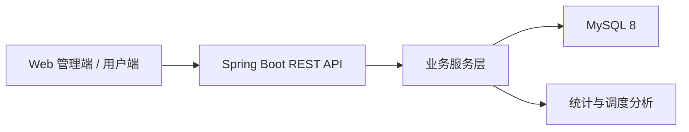
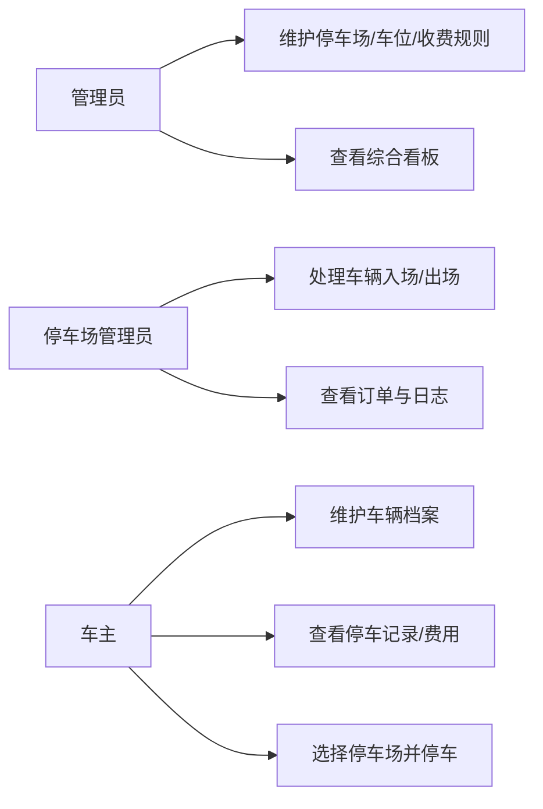
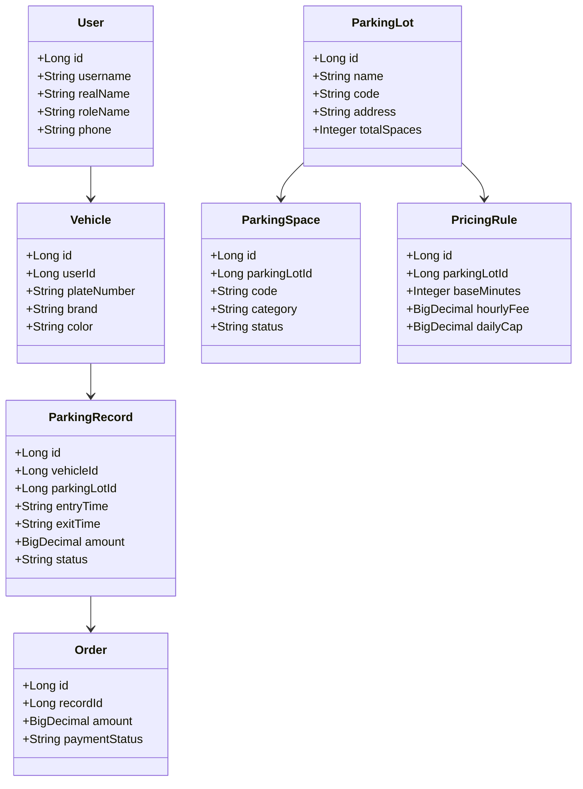
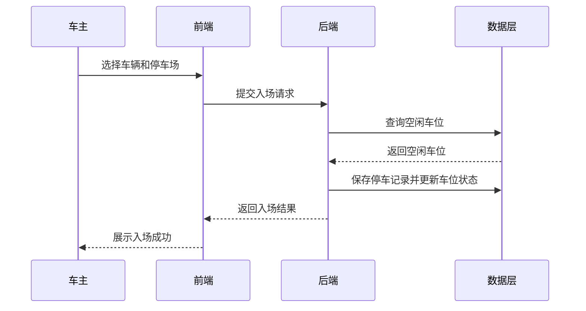
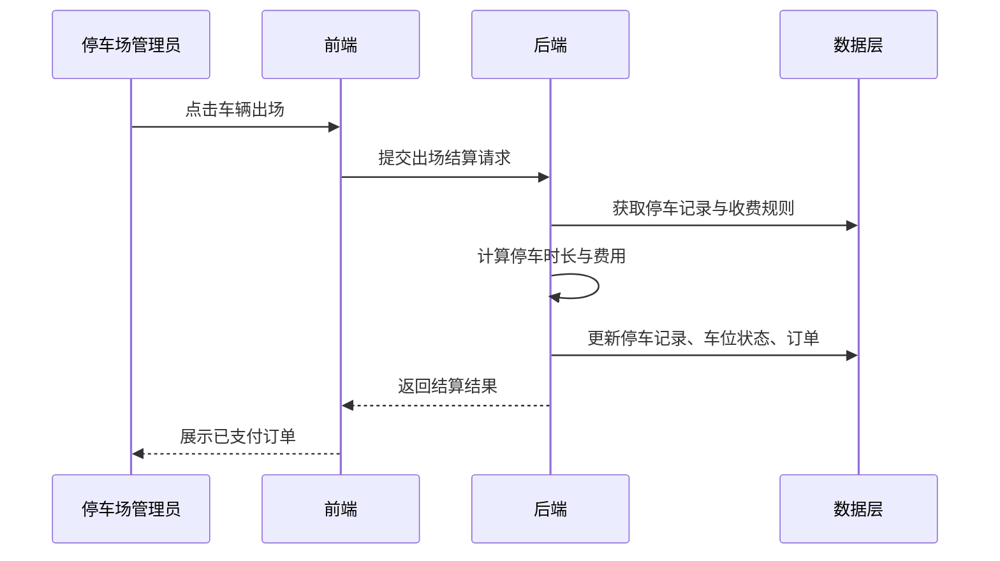
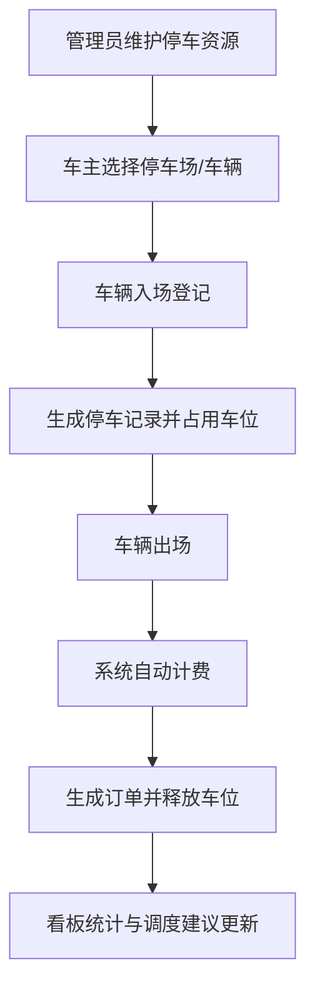
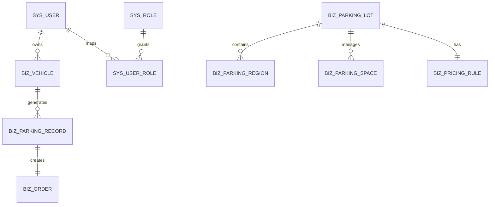

# 城市停车资源管理系统技术文档

## 1. 需求分析

### 1.1 项目背景

城市停车资源分散、车位状态变化快、传统人工登记效率低，导致停车难、管理难、运营分析难。本系统面向管理员、停车场管理员和车主三类用户，构建一个统一的城市停车资源管理平台。

### 1.2 功能需求

- 用户与权限管理：支持管理员、停车场管理员、车主三类角色登录和菜单展示。
- 停车资源管理：维护停车场、区域、车位、收费规则等基础数据。
- 停车业务管理：支持车辆入场、车辆出场、费用结算、订单生成和记录查询。
- 数据看板：展示停车场数量、车位总量、占用率、流量趋势、累计收入。
- 资源调度建议：根据占用率生成预警等级和调度建议。
- 系统支撑：公告信息、操作日志、团队分工和演示说明。

### 1.3 非功能需求

- 界面直观，适合毕业设计答辩现场展示。
- 核心流程可在本地环境完整演示。
- 文档齐全，便于提交毕设材料。

## 2. 系统设计

### 2.1 总体架构

### 2.2 用例图

### 2.3 类图

### 2.4 时序图

#### 车辆入场

#### 车辆出场计费

### 2.5 业务流程图

### 2.6 E-R 图

## 3. 数据库表设计

| 表名 | 说明 | 关键字段 |
| --- | --- | --- |
| `sys_user` | 用户表 | `username`、`real_name`、`role_name` |
| `sys_role` | 角色表 | `role_code`、`role_name` |
| `sys_user_role` | 用户角色关联表 | `user_id`、`role_id` |
| `biz_vehicle` | 车辆表 | `user_id`、`plate_number` |
| `biz_parking_lot` | 停车场表 | `name`、`code`、`total_spaces` |
| `biz_parking_region` | 区域表 | `parking_lot_id`、`region_name` |
| `biz_parking_space` | 车位表 | `parking_lot_id`、`code`、`status` |
| `biz_pricing_rule` | 收费规则表 | `parking_lot_id`、`hourly_fee`、`daily_cap` |
| `biz_parking_record` | 停车记录表 | `vehicle_id`、`entry_time`、`exit_time` |
| `biz_order` | 订单表 | `record_id`、`amount`、`payment_status` |
| `sys_notice` | 公告表 | `title`、`content` |
| `sys_operation_log` | 操作日志表 | `action_name`、`detail_text` |

## 4. 接口设计

| 模块 | 方法 | 路径 | 说明 |
| --- | --- | --- | --- |
| 认证 | `POST` | `/api/auth/login` | 登录 |
| 认证 | `GET` | `/api/auth/me` | 获取项目信息和默认账号 |
| 用户 | `GET` | `/api/users` | 获取用户列表 |
| 用户 | `GET/POST` | `/api/users/vehicles` | 查询 / 新增车辆 |
| 资源 | `GET/POST` | `/api/parking/lots` | 查询 / 新增停车场 |
| 资源 | `GET` | `/api/parking/spaces` | 查询车位信息 |
| 业务 | `POST` | `/api/records/check-in` | 车辆入场 |
| 业务 | `POST` | `/api/records/check-out` | 车辆出场 |
| 业务 | `GET` | `/api/records` | 查询停车记录 |
| 统计 | `GET` | `/api/dashboard/overview` | 综合看板 |
| 统计 | `GET` | `/api/dashboard/dispatch-suggestions` | 调度建议 |
| 系统 | `GET` | `/api/system/notices` | 公告 |
| 系统 | `GET` | `/api/system/logs` | 日志 |

## 5. 系统实现说明

- 后端采用 Spring Boot 单体架构，控制器按业务模块拆分。
- 为保证答辩演示可靠性，后端内置演示数据层；同时提供 MySQL 建表和初始化 SQL 便于后续扩展。
- 前端采用 Vue 3 + TypeScript，统一页面内切换“数据看板 / 管理端 / 用户端 / 交付材料”四种视图。
- 前端若检测不到本地后端，会自动回退到内置演示数据模式，避免因环境问题影响答辩。

## 6. 系统截图建议

答辩材料中建议至少截取以下页面：

1. 首页综合看板
2. 管理端停车场资源管理页面
3. 用户端车辆档案与车辆入场页面
4. 车辆出场结算与订单展示页面
5. 项目交付材料展示页面
